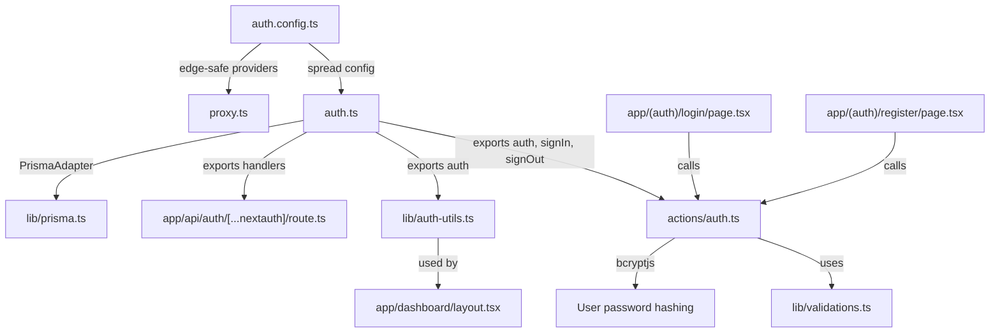

# Authentication Implementation Plan — DevStash

## Goal

Implement full authentication for DevStash using **Auth.js v5 (NextAuth)** with:
- **GitHub OAuth** provider
- **Credentials** provider (email + password with bcrypt)
- **Edge-compatible** middleware as proxy.ts for route protection
- **JWT session strategy** (required for edge runtime)
- **Prisma adapter** for database persistence

## Background & Edge Compatibility Strategy

Auth.js v5 uses a **split-config pattern** for edge compatibility:

| File | Runtime | Purpose |
|------|---------|---------|
| `auth.config.ts` | **Edge** | Providers + callbacks — no DB imports |
| `auth.ts` | **Node.js** | Full config with Prisma adapter |
| `proxy.ts` | **Edge** | Route protection using `auth.config.ts` |

> [!IMPORTANT]
> The edge runtime cannot use Node.js APIs (like Prisma or bcrypt). The split config ensures middleware proxy.ts runs at the edge while DB operations happen in the Node.js runtime.

**JWT vs Database sessions**: We use `session: { strategy: "jwt" }` because:
1. JWT tokens can be verified at the edge without DB calls
2. Middleware proxy.ts runs in edge runtime — no Prisma access
3. The Prisma adapter still handles account/user persistence on sign-up

## User Review Required

> [!IMPORTANT]
> **Prisma schema changes**: The existing schema already has `Account`, `Session`, `User` (with `password` field), and `VerificationToken` models. **No schema migration needed** — we only modify the generator to add `prismaClientExtensionModel` for the adapter.

> [!WARNING]
> **bcryptjs in Credentials `authorize`**: The `authorize` callback runs in Node.js runtime (not edge), so `bcryptjs` works fine. However, the Credentials provider does NOT work with the Prisma adapter's automatic user creation — we must handle user lookup manually.

> [!CAUTION]
> **Environment variables required**: You'll need to configure `AUTH_SECRET`, `AUTH_GITHUB_ID`, `AUTH_GITHUB_SECRET`, and `DATABASE_URL` before testing. I'll create a `.env.example` file.

## Proposed Changes

### Dependencies

#### Install packages

```bash
npm install next-auth@beta @auth/prisma-adapter zod
```

- `next-auth@beta` — Auth.js v5 for Next.js
- `@auth/prisma-adapter` — Connects Auth.js to Prisma ORM
- `zod` — Input validation (already a peer dep, may need explicit install)

---

### Auth Core Configuration

#### [NEW] [auth.config.ts](file:///c:/Users/ramam/Desktop/devstash/auth.config.ts)

Edge-safe auth config containing **only providers and callbacks** — no DB/Prisma imports.

```typescript
// Providers: GitHub OAuth + Credentials (email/password)
// Callbacks: authorized(), jwt(), session()
// Pages: custom sign-in/sign-up routes
// NO database adapter or Prisma imports
```

Key decisions:
- `authorized` callback in `callbacks` — controls route access in middleware proxy.ts
- `pages.signIn` → `/login` (custom page)
- Credentials provider defines `email` and `password` fields
- The `authorize` function is **lazy-imported** from `auth.ts` to avoid pulling Node.js deps into edge

#### [NEW] [auth.ts](file:///c:/Users/ramam/Desktop/devstash/auth.ts)

Full Node.js auth config that merges `auth.config.ts` + adds Prisma adapter.

```typescript
// Imports: NextAuth, PrismaAdapter, prisma client, authConfig
// Exports: { auth, handlers, signIn, signOut }
// Config: adapter: PrismaAdapter(prisma), session: { strategy: "jwt" }
// Spreads ...authConfig for providers/callbacks
```

#### [NEW] [proxy.ts](file:///c:/Users/ramam/Desktop/devstash/proxy.ts)

Edge-compatible middleware as proxy.ts for route protection.

```typescript
// Imports: NextAuth from "next-auth" + authConfig (edge-safe)
// Exports: { auth as proxy }
// config.matcher: protects /dashboard/**, /api/** (except /api/auth/**)
```
```example 
import { auth } from "@/auth"
 
 export const proxy = auth((req) => {
 if (!req.auth && req.nextUrl.pathname !== "/login") {
    const newUrl = new URL("/login", req.nextUrl.origin)
    return Response.redirect(newUrl)
  }
})
export const config = {
  matcher: ["/((?!api|_next/static|_next/image|favicon.ico).*)"],
}
```


---

### API Route Handler

#### [NEW] [route.ts](file:///c:/Users/ramam/Desktop/devstash/app/api/auth/%5B...nextauth%5D/route.ts)

Next.js route handler for Auth.js.

```typescript
// Re-exports { GET, POST } from handlers in auth.ts
```

---

### Auth Utilities

#### [NEW] [lib/auth-utils.ts](file:///c:/Users/ramam/Desktop/devstash/lib/auth-utils.ts)

Server-side helper to get the current session in server components/actions.

```typescript
// getCurrentUser() — calls auth(), returns session.user or null
// requireAuth() — calls auth(), throws/redirects if not authenticated
```

#### [NEW] [lib/validations.ts](file:///c:/Users/ramam/Desktop/devstash/lib/validations.ts)

Zod schemas for auth form validation (shared between client and server).

```typescript
// signInSchema: z.object({ email: z.string().email(), password: z.string().min(8) })
// signUpSchema: extends signInSchema + name field + password confirmation
```
>[!Note]
> double check the zod schemas format using the following page : https://zod.dev/api

> [!NOTE]
> If `lib/validations.ts` already exists, we'll add auth schemas to it. Currently it does not exist.

---

### Server Actions

#### [NEW] [actions/auth.ts](file:///c:/Users/ramam/Desktop/devstash/actions/auth.ts)

Server Actions for login, register, and logout.

```typescript
// loginAction(formData) — validates with Zod, calls signIn("credentials", ...)
// registerAction(formData) — validates, hashes password with bcryptjs, creates user via Prisma, then signs in
// logoutAction() — calls signOut()
```

---

### Auth UI Pages

#### [NEW] [app/(auth)/layout.tsx](file:///c:/Users/ramam/Desktop/devstash/app/(auth)/layout.tsx)

Minimal centered layout for auth pages (no sidebar/navbar).

#### [NEW] [app/(auth)/login/page.tsx](file:///c:/Users/ramam/Desktop/devstash/app/(auth)/login/page.tsx)

Login page with:
- Email/password form using `useActionState`
- GitHub OAuth button
- Link to register page

#### [NEW] [app/(auth)/register/page.tsx](file:///c:/Users/ramam/Desktop/devstash/app/(auth)/register/page.tsx)

Register page with:
- Name, email, password, confirm password form
- GitHub OAuth button
- Link to login page

---

### Dashboard Route Protection

#### [MODIFY] [app/dashboard/layout.tsx](file:///c:/Users/ramam/Desktop/devstash/app/dashboard/layout.tsx)

Add server-side session check. Redirect to `/login` if not authenticated.

---

### Environment & Config

#### [NEW] [.env.example](file:///c:/Users/ramam/Desktop/devstash/.env.example)

Template with all required environment variables:

```bash
DATABASE_URL="postgresql://..."
AUTH_SECRET="generate-with-npx-auth-secret"
AUTH_GITHUB_ID=""
AUTH_GITHUB_SECRET=""
```

---

## File Dependency Graph



## Verification Plan

### Automated Tests

1. **Build verification** — ensures no edge/Node.js runtime conflicts:
   ```bash
   npm run build
   ```
   This is critical because it will catch any edge-incompatible imports in `proxy.ts` or `auth.config.ts`.

2. **Lint check**:
   ```bash
   npm run lint
   ```

### Manual Verification (Browser)

> These should be verified after starting the dev server with `npm run dev`:

1. **Unauthenticated redirect**: Navigate to `http://localhost:3000/dashboard` → should redirect to `/login`
2. **Login page renders**: Navigate to `/login` → should see email/password form + GitHub button
3. **Register page renders**: Navigate to `/register` → should see registration form + GitHub button
4. **Registration flow**: Fill in name/email/password on `/register` → submit → should create user and redirect to `/dashboard`
5. **Login flow**: Sign out, then log in with the registered email/password → should redirect to `/dashboard`
6. **GitHub OAuth**: Click "Continue with GitHub" → should redirect to GitHub, authorize, and return to `/dashboard`
7. **Session persistence**: After login, refresh the page → should remain authenticated
8. **Sign out**: Click sign out → should redirect to `/login`
9. **API protection**: Try `GET /api/items` without auth → should return 401

> [!NOTE]
> GitHub OAuth requires setting up a GitHub OAuth App at https://github.com/settings/developers. Set the callback URL to `http://localhost:3000/api/auth/callback/github`.
