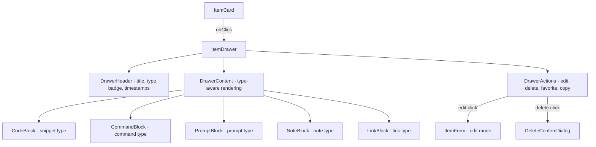

# Item Drawer — Implementation Plan

Display a slide-over drawer when clicking an item card, showing **all item data** with type-aware content formatting (code editor look for snippets, terminal style for commands, etc.). Includes Edit, Delete, and Favorite action buttons.

---

## User Review Required

> [!IMPORTANT]
> **Sheet component**: The project uses `@base-ui/react` (not Radix). We need to add a `Sheet` (drawer) component. Two options:
> 1. Use shadcn's Sheet component (which wraps `@base-ui/react/dialog` under the hood) — **recommended**, keeps consistency.
> 2. Build a custom slide-over from `@base-ui/react/dialog` with CSS transforms.
>
> **Recommendation**: Option 1 — install via `npx shadcn@latest add sheet`.

> [!IMPORTANT]
> **Syntax highlighting library**: For code snippets to look like a code editor, we need a syntax highlighter. Options:
> 1. **Shiki** — Static HTML output, works with Server Components, VSCode-grade themes. ~150KB for common languages.
> 2. **Prism.js (react-prism-renderer)** — Lighter, client-only, good theme support. ~30KB.
> 3. **Plain CSS** — Just monospace font + dark background, no actual highlighting.
>
> **Recommendation**: Option 2 (`prism-react-renderer`) — lightweight, client-side, great theme support, works well for a drawer that's already a client component.

> [!WARNING]
> **Edit mode**: The plan reuses the existing `ItemForm` dialog but extends it to accept an optional `item` prop for pre-filling fields. This requires modifying `item-form.tsx` and adding an `updateItemAction` server action.

---

## Proposed Changes

### Component Architecture



---

### Server Actions — `actions/items.ts`

#### [MODIFY] [items.ts](file:///c:/Users/ramam/Desktop/devstash/actions/items.ts)

Add three new server actions:

| Action | Purpose |
|--------|---------|
| `updateItemAction` | Update an existing item (revalidates paths) |
| `deleteItemAction` | Delete an item by ID with ownership check |
| `toggleFavoriteAction` | Toggle `isFavorite` on an item |

---

### Validation Schemas — `lib/validations.ts`

#### [MODIFY] [validations.ts](file:///c:/Users/ramam/Desktop/devstash/lib/validations.ts)

Add `updateItemSchema` (mirrors `createItemSchema` but with `id` field required).

---

### Types — `types/dashboard.ts`

#### [MODIFY] [dashboard.ts](file:///c:/Users/ramam/Desktop/devstash/types/dashboard.ts)

Add `createdAt: string` to `DashboardItem` so the drawer header can display "Created" and "Updated" timestamps.

---

### Queries — `lib/queries.ts`  

#### [MODIFY] [queries.ts](file:///c:/Users/ramam/Desktop/devstash/lib/queries.ts)

Add `createdAt` to the `select` clause and mapping in `getRecentItems()` and `getItemsByType()`.

---

### UI Components

#### [NEW] `components/ui/sheet.tsx`

Install via `npx shadcn@latest add sheet`. Provides the slide-over Sheet primitive (right-side drawer, 600px on desktop, full-width on mobile).

---

### Item Components

#### [NEW] [item-drawer.tsx](file:///c:/Users/ramam/Desktop/devstash/components/items/item-drawer.tsx)

The main drawer component. Structure:

```
┌─────────────────────────────────────────┐
│ ● Header                                │
│   [Type Icon + Badge]  [★ Fav] [✎ Edit] │
│   Title (large)                         │
│   Created: Apr 8 · Updated: 2 hrs ago   │
│   #tag1  #tag2  #tag3                   │
├─────────────────────────────────────────┤
│ ● Description (if present)              │
│   "This snippet handles auth..."        │
├─────────────────────────────────────────┤
│ ● Content (type-aware)                  │
│   ┌───────────────────────────────┐     │
│   │ // For snippets:              │     │
│   │ Syntax-highlighted code block │     │
│   │ with language label + copy btn│     │
│   └───────────────────────────────┘     │
│                                         │
│   OR terminal block for commands        │
│   OR styled prompt block                │
│   OR rendered note text                 │
│   OR clickable link with preview        │
├─────────────────────────────────────────┤
│ ● URL (for links only)                  │
│   🔗 https://example.com  [Open ↗]      │
├─────────────────────────────────────────┤
│ ● Footer Actions                        │
│   [🗑 Delete]              [✎ Edit]     │
└─────────────────────────────────────────┘
```

**Props:**
```typescript
interface ItemDrawerProps {
  item: DashboardItem | null;
  open: boolean;
  onOpenChange: (open: boolean) => void;
}
```

**Type-aware content rendering:**

| Item Type | Rendering |
|-----------|-----------|
| **Snippet** | Syntax-highlighted code block (monospace font, dark background, language badge, line numbers, copy button) |
| **Command** | Terminal-style block (`$` prefix, monospace, dark bg with green text accent, copy button) |
| **Prompt** | Styled block with AI sparkle icon, soft purple background tint, copy button |
| **Note** | Prose-styled text with proper paragraph spacing |
| **Link** | Clickable URL with external link icon, "Open in new tab" button |

---

#### [NEW] [delete-confirm-dialog.tsx](file:///c:/Users/ramam/Desktop/devstash/components/items/delete-confirm-dialog.tsx)

A confirmation dialog using the existing `Dialog` component:

- Shows item title prominently
- Warning message: "This action cannot be undone"
- **Cancel** button (outline) + **Delete** button (destructive red)
- Loading state while deleting
- Closes on success

---

#### [MODIFY] [item-form.tsx](file:///c:/Users/ramam/Desktop/devstash/components/items/item-form.tsx)

Extend to support **edit mode**:

- Accept optional `editItem?: DashboardItem` prop
- Pre-fill form fields when `editItem` is provided
- Change title: "Create New Item" → "Edit Item"
- Change submit button: "Create Item" → "Save Changes"
- Call `updateItemAction` instead of `createItemAction` when editing
- Tags pre-populated from `editItem.tags`

---

#### [MODIFY] [item-card.tsx](file:///c:/Users/ramam/Desktop/devstash/components/dashboard/item-card.tsx)

- Add `onClick` handler to open the drawer
- Accept `onItemClick?: (item: DashboardItem) => void` prop

---

#### [MODIFY] [items-grid.tsx](file:///c:/Users/ramam/Desktop/devstash/components/items/items-grid.tsx)

- Manage drawer open/close state
- Track selected item
- Render `ItemDrawer` component
- Render `ItemForm` for edit mode
- Render `DeleteConfirmDialog`

---

## File Change Summary

| File | Action | Purpose |
|------|--------|---------|
| `components/ui/sheet.tsx` | NEW | Shadcn Sheet (slide-over drawer) primitive |
| `components/items/item-drawer.tsx` | NEW | Main item detail drawer with type-aware rendering |
| `components/items/delete-confirm-dialog.tsx` | NEW | Delete confirmation dialog |
| `components/items/item-form.tsx` | MODIFY | Add edit mode support |
| `components/items/items-grid.tsx` | MODIFY | Wire up drawer state + callbacks |
| `components/dashboard/item-card.tsx` | MODIFY | Add onClick handler |
| `actions/items.ts` | MODIFY | Add update, delete, toggleFavorite actions |
| `lib/validations.ts` | MODIFY | Add updateItemSchema |
| `types/dashboard.ts` | MODIFY | Add createdAt to DashboardItem |
| `lib/queries.ts` | MODIFY | Include createdAt in queries |
| `package.json` | MODIFY | Add `prism-react-renderer` dependency |

---

## Open Questions

1. **Syntax highlighting**: Are you happy with `prism-react-renderer` or do you prefer **Shiki** (heavier but VSCode-quality highlighting)?
2. **Drawer width**: The design spec says 600px desktop. Should it be wider for code snippets (e.g. 700px)?
3. **Copy feedback**: Should the "Copied!" toast use a custom toast system or a simple inline tooltip that fades out?

---

## Verification Plan

### Automated Tests
- `npm run build` — Verify no type errors or build failures
- `npm run lint` — No new lint warnings

### Manual / Browser Verification
- Click an item card → drawer slides in from the right
- Verify type-aware rendering for each type (snippet, command, prompt, note, link)
- Copy button copies content to clipboard
- Favorite toggle updates UI and persists
- Edit button opens ItemForm pre-filled → save updates item
- Delete button shows confirmation → confirm deletes item and closes drawer
- Mobile: drawer takes full width
- Keyboard: Escape closes drawer
